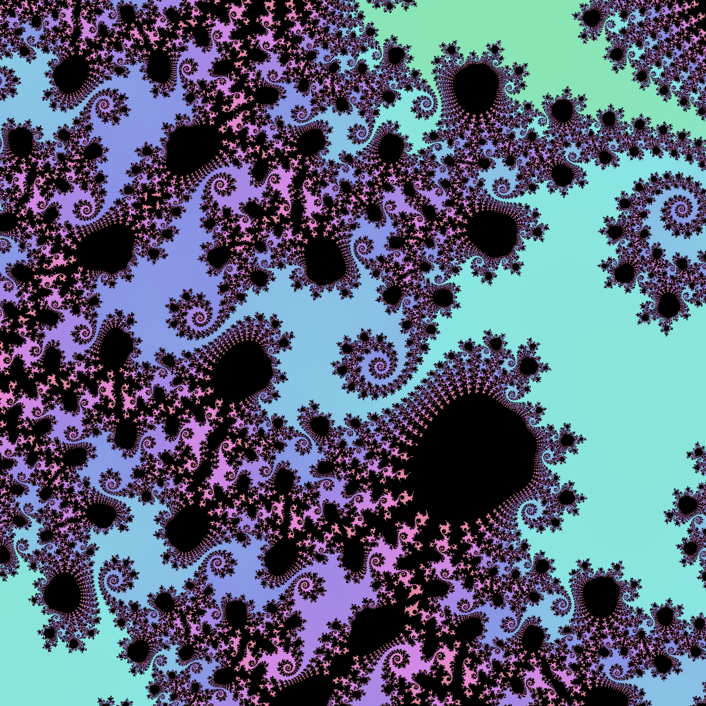

This program is heavily inspired by the "Random Mandelbrot" bot on Twitter (yes, I still call it Twitter):
https://twitter.com/randommandelbot. I'm not sure what happened to them but I assume they moved to bluesky or something.
I wanted to write my own Mandelbrot view generator

Examples:

We use a classic iterative approach to visualize the Mandelbrot set,

- Coordinate Mapping: Each pixel in the output image is mapped to a complex number `c` in the complex plane
- Iteration: For each point, we apply the formula z = z² + c repeatedly, starting with `z = 0`
- Escape Detection: We track how many iterations it takes before |z| exceeds 2 (implemented as z.norm_sqr() <= 4.0 for
  efficiency). Points that never "escape" after `MAX_ITERATIONS` are considered part of the Mandelbrot set.
- Coloring: We use the number of iterations before escape to determine the color of each pixel. Points that never escape
  are colored black, while others receive colors based on their "escape speed."

Region Selection Logic:

- Predefined Interesting Regions: we maintain a weighted list of known interesting coordinates like bulb boundaries,
  filaments, and mini-Mandelbrots.
- Random Variation: It introduces variation by randomly selecting a point within a radius of these key coordinates and
  applying an appropriate zoom level.
- Interest Testing: Before rendering a region, we sample points to ensure the area has a good balance:
  - Between 5-95% of sampled points should be inside the set
  - There should be at least one non-zero bucket for points outside the set (ensuring color variation)

Details:

- Image dimensions: 2000x2000 pixels as PNG
- Maximum iterations: 1000 iterations to determine if a point escapes
- Zoom levels: Automatically calibrated based on the region size
- Color schemes: 9 different options

Resources:

- https://twitter.com/randommandelbot
- https://en.wikipedia.org/wiki/Plotting_algorithms_for_the_Mandelbrot_set
- https://mathworld.wolfram.com/MandelbrotSet.html
- https://math.stackexchange.com/questions/2181175/value-to-use-as-center-of-mandelbrot-set-zoom
